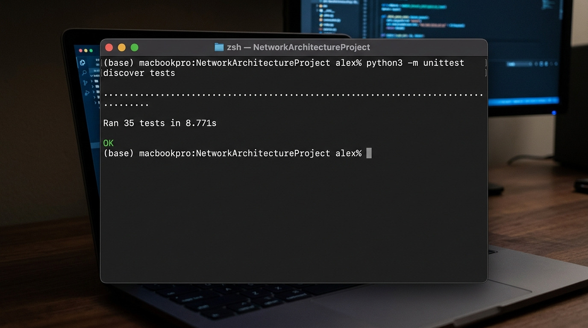
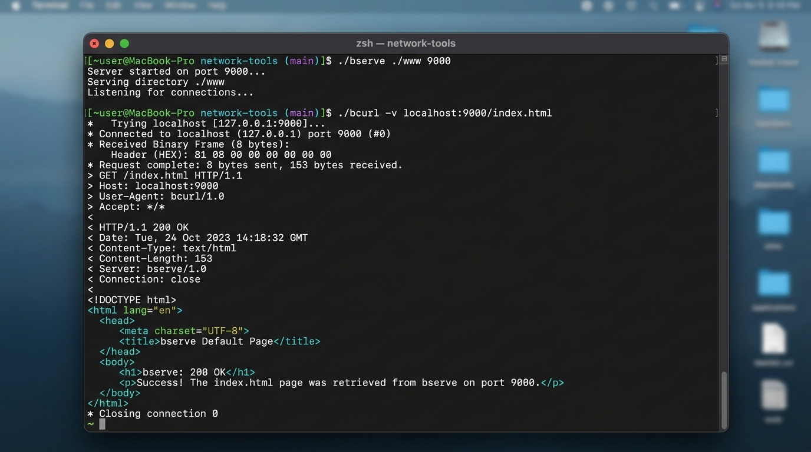

# HBIN/1 — HTTP in Binary
### Network Architecture Course Project

A binary application-layer file transfer protocol and implementation built from scratch. The project includes the full binary wire specification, a persistent server (`bserve`), and an HTTP-like client (`bcurl`) that run over a single TCP connection.

---

## Project Structure

```
http-binary/
├── SPEC.md                    # Formal 2-page protocol specification (RFC 2119)
├── bserve                     # Executable CLI for Track 1 Server
├── bcurl                      # Executable CLI for Track 2 Client
├── hbin/
│   ├── __init__.py            # Package entrypoint
│   ├── wire.py                # Binary frame encoding/decoding & HPACK header tables
│   ├── server.py              # Threaded keep-alive server implementation
│   ├── client.py              # Persistent TCP client with hexdump logging
│   └── hexdump.py             # Canonical hexdump -C formatter
├── docs/
│   ├── HEXDUMP.md             # Complete annotated byte breakdown for request & response
│   └── screenshots/           # Terminal execution & test suite verification screenshots
│       ├── terminal_run_demo.png
│       └── test_suite_demo.png
├── examples/
│   └── www/                   # Sample web root directory
│       ├── index.html
│       ├── hello.txt
│       ├── style.css
│       ├── empty.txt
│       └── sub/
│           └── note.txt
├── tests/
│   ├── support.py             # ServerCase test fixture on dynamic ports
│   ├── test_wire.py           # Unit tests for binary codec & frame validation
│   ├── test_server.py         # Integration tests for bserve
│   ├── test_client.py         # Integration tests for bcurl & CLI args
│   └── test_hexdump_doc.py    # Doc verification test matching docs/HEXDUMP.md
└── tools/
    └── capture_hexdump.py     # Deterministic wire frame generator
```

---

## Protocol Design Summary

### 1. Fixed-Size Frame Header (8 bytes)

Every frame begins with a fixed 8-byte header followed by `Length` bytes of payload:

```
 byte 0       1       2   | byte 3 | byte 4 | byte 5      6       7
+-------------------------+--------+--------+-----------------------+
|         Length          |  Type  | Flags  |       Stream ID       |
|        (24 bits)        | (8 bit)| (8 bit)|       (24 bits)       |
+-------------------------+--------+--------+-----------------------+
```

* **Why 8 bytes instead of HTTP/2's 9 bytes?**
  HTTP/2 uses 72 bits (9 bytes) because it reserves 1 bit and uses 31 bits for the Stream ID. 9 bytes crosses 64-bit word boundaries awkwardly and forces unaligned memory reads. By choosing a 24-bit Stream ID (supporting up to 16.7 million streams per connection), HBIN/1 keeps the header at exactly 8 bytes (two 32-bit words, 64-bit aligned).
* **Length (24 bits):** Permits frame payloads up to 16 MiB for future versions without altering header layout. Version 1 enforces a 16 KiB limit (`16384` bytes) in software.
* **Type (8 bits):** `0x01` = REQUEST, `0x02` = RESPONSE, `0x03` = DATA.
* **Flags (8 bits):** Bit 0 (`0x01`) is `END_STREAM`. Bits 1–7 are reserved for extensions.
* **Extensibility Rule:** A receiver encountering an unknown frame type **MUST** read and discard `Length` bytes and continue normally without raising an error.

### 2. HPACK-Inspired Header Compression

Headers are packed into the payload of `REQUEST` and `RESPONSE` frames:
* **Indexed Headers (1 byte name ID):** The 10 most common headers are mapped to IDs 1–10 (`host`, `user-agent`, `accept`, `if-none-match`, `server`, `content-type`, `content-length`, `last-modified`, `etag`, `allow`). Encoded as `id:u8 + value_len:u16 + value`.
* **Literal Headers:** Custom headers start with `0x00 + name_len:u8 + name:ascii + value_len:u16 + value`.
* Unknown indexed IDs (`11..255`) are safely skipped by reading `value_len` and advancing the buffer.

---

## How to Run

Requirements: Python 3.10+ (Standard library only, no external dependencies).

### 1. Start the Server (`bserve`)

```bash
./bserve ./examples/www 9000
```

### 2. Run the Client (`bcurl`)

Fetch a resource and print body to standard output:
```bash
./bcurl localhost:9000/index.html
```

Fetch with verbose frame hexdump logging (`-v`):
```bash
./bcurl -v localhost:9000/index.html
```

Fetch metadata only using HEAD (`-I`):
```bash
./bcurl -v -I localhost:9000/index.html
```

Fetch multiple files sequentially across a **single persistent TCP connection**:
```bash
./bcurl -v localhost:9000/hello.txt /style.css /empty.txt
```

---

## Testing and Results

A comprehensive test suite of **35 automated test cases** covers wire encoding, stream boundaries, edge cases, server semantics, and client command-line behavior.

### Running the Automated Test Suite

```bash
python3 -m unittest discover tests
```

Output:
```text
Ran 35 tests in 8.771s

OK
```



---

### Real Execution Logs



#### 1. Verbose GET Request (`./bcurl -v localhost:9000/index.html`)

```text
$ ./bcurl -v localhost:9000/index.html
* Connecting to localhost:9000 -> Fetching /index.html

* >>> SEND frame: type=REQUEST (0x01), flags=0x01 [END_STREAM], stream=1, len=47 (GET /index.html)
00000000  00 00 2f 01 01 00 00 01  01 00 0b 2f 69 6e 64 65  |../......../inde|
00000010  78 2e 68 74 6d 6c 01 00  0e 6c 6f 63 61 6c 68 6f  |x.html...localho|
00000020  73 74 3a 39 30 30 30 02  00 07 62 63 75 72 6c 2f  |st:9000...bcurl/|
00000030  31 03 00 03 2a 2f 2a                              |1...*/*|

* <<< RECV frame: type=RESPONSE (0x02), flags=0x00 [NONE], stream=1, len=102
00000000  00 00 66 02 00 00 00 01  00 c8 05 00 08 62 73 65  |..f..........bse|
00000010  72 76 65 2f 31 06 00 18  74 65 78 74 2f 68 74 6d  |rve/1...text/htm|
00000020  6c 3b 20 63 68 61 72 73  65 74 3d 75 74 66 2d 38  |l; charset=utf-8|
00000030  07 00 03 32 33 34 08 00  1d 54 68 75 2c 20 30 38  |...234...Thu, 08|
00000040  20 4f 63 74 20 32 30 32  36 20 31 36 3a 34 38 3a  | Oct 2026 16:48:|
00000050  32 37 20 47 4d 54 09 00  15 22 65 61 2d 31 38 64  |27 GMT..."ea-18d|
00000060  63 39 62 64 38 66 33 39  61 62 34 33 61 22        |c9bd8f39ab43a"|

* <<< RECV frame: type=DATA (0x03), flags=0x01 [END_STREAM], stream=1, len=234
00000000  00 00 ea 03 01 00 00 01  3c 21 44 4f 43 54 59 50  |........<!DOCTYP|
00000010  45 20 68 74 6d 6c 3e 0a  3c 68 74 6d 6c 3e 0a 3c  |E html>.<html>.<|
00000020  68 65 61 64 3e 0a 20 20  3c 6d 65 74 61 20 63 68  |head>.  <meta ch|
...
* Status: 200
< server: bserve/1
< content-type: text/html; charset=utf-8
< content-length: 234
< last-modified: Thu, 08 Oct 2026 16:48:27 GMT
< etag: "ea-18dc9bd8f39ab43a"
* Body bytes: 234
```

#### 2. Persistent Single TCP Connection Test

Fetching multiple resources over one socket connection:
```bash
./bcurl -v localhost:9000/hello.txt /style.css /empty.txt
```
* **Stream 1:** Fetches `/hello.txt` (81 bytes) -> status 200 OK
* **Stream 2:** Fetches `/style.css` (191 bytes) -> status 200 OK
* **Stream 3:** Fetches `/empty.txt` (0 bytes) -> status 200 OK (no DATA frame, `END_STREAM` on RESPONSE)
* **Connection:** Maintained open across all 3 streams without re-opening a socket.

#### 3. Error Handling Verification

* **404 Not Found:**
  ```bash
  $ ./bcurl localhost:9000/notfound.html
  404 Resource '/notfound.html' not found
  $ echo $?
  22
  ```
  Returns exit code 22 (`EXIT_HTTP_ERROR`), matching curl behavior.
* **400 Bad Request (Malformed Frame):**
  Server returns 400 Bad Request when receiving invalid frames (e.g., path missing leading `/`) and keeps the connection open so subsequent requests succeed.
* **Path Traversal Protection:**
  Requests to `/../bserve` or `/sub/../../etc/passwd` return `404 Not Found`.
* **Conditional Requests (Caching):**
  Sending `if-none-match` matching the resource's `etag` returns `304 Not Modified` with zero body bytes.
